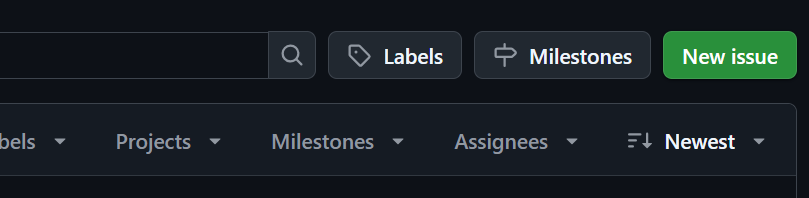
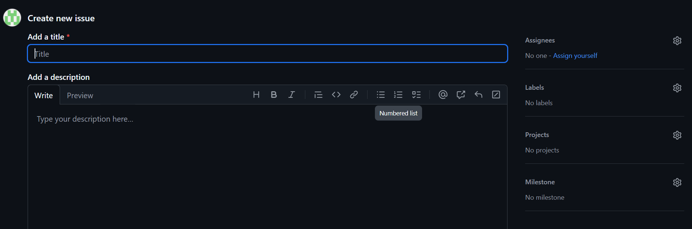
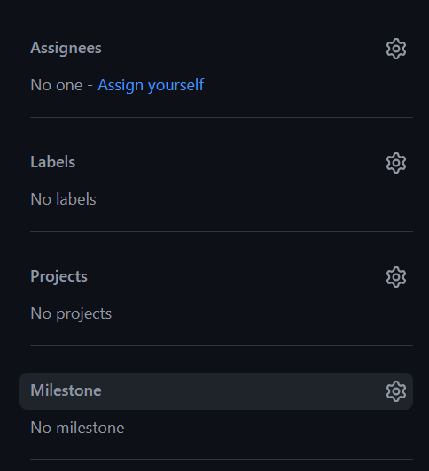
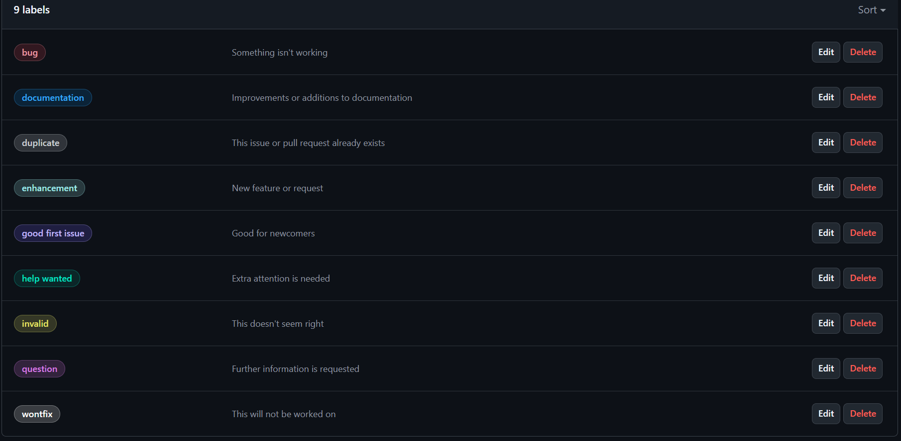

# ¿CÓMO USAR GITHUB ISSUES? Una breve guía de inicio rápido
## ¿Qué es GitHub Issues?
Es una herramienta integrada en <u>GitHub</u> que permite a los usuarios:
1. Reportar errores
2. Sugerir mejoras
3. Gestionar tareas

... todo esto dentro de un proyecto. Es útil para desarrolladores, gerentes de proyecto y colaboradores en código abierto.

## **¿Cómo crear un Issue?🛠️**
Para crear un issue hay que seguir los siguientes pasos:
1. Ir al repositorio de GitHub
2. Hacer click en la pestaña que dice **"Issues"**

3. Seleccionar la opción **"New Issues"**

4. Esribir un título descriptivo y una descripción detallada del problema o tarea. En la descripción, se debe asegurar de explicar el propósito del issue incluyendo cualquier detalle que pueda ayudar a resolverla. 

5. Opcionalmente, puedes agregar **etiquetas (label)**, **asignaciones (Assignees)** e **hitos (milestone)** para organizar mejor el Issue.

## ¿Cómo organizar y gestionar un issue?
En el último paso de la creación de un issue, vimos que se podía agregar etiquetas, asignaciones e hitos. A continuación, se explicará de que trata cada uno de estos términos:

1. Etiquetas (labels): ayudan a categorizar el issue. Cualquier usuario puede filtrar los issues según la etiqueta. Uno puede crear su propia etiqueta o puede usar una predeterminada. Por ejemplo, existen las siguientes etiquetas: bug, enhancement, documentation.

2. Asignaciones (assignees): permiten asignar issues a miembros del equipo responsables de resolverlos.

3. Hitos (milestone): agrupan issues bajo un objetivo en común y puede asignarse una fecha límite. Un hito podrá mostrar el progreso del issue conforme se va llegando a la fecha establecida.

## ¿Cómo comunicar y hacer seguimiento de un issue?
1. Comentarios:

Una vez creado el issue, puede agregarse comentarios al mismo para discutir, proponer soluciones o compartir actualizaciones.

2. Menciones:

Además de realizar el comentario, se puede mencionar a un miembro del equipo usando @usuario. Esto notifica a un usuario específico para que se fije en el comentario.

3. Lista de tareas:

Se puede agregar una checklist para dividir el trabajo en subtareas. Es especialmente útil para desglosar issues grandes en más pequeñas de realizar. Para agregar una lista de tareas, se debe usar [] como prefijo de los elementos de la lista. Si se requiere más seguimiento o discusión de cierta puede convertirse en una issue si se desliza el punto de mousee sobre la tarea y se hace click en el círculo verde que se encuentra en la esquina superior derecha de la misma (observar la imagen). 

## Referencias
Para mayor información de cómo usar GitHub Issues, puede dirigirse al siguiente enlace:
[https://docs.github.com/es/issues/tracking-your-work-with-issues/configuring-issues/quickstart](https://docs.github.com/es/issues/tracking-your-work-with-issues/configuring-issues/quickstart)
